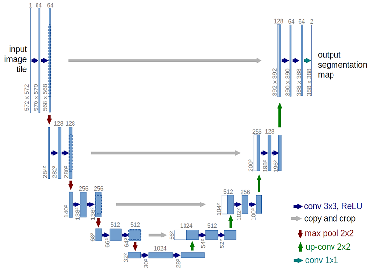
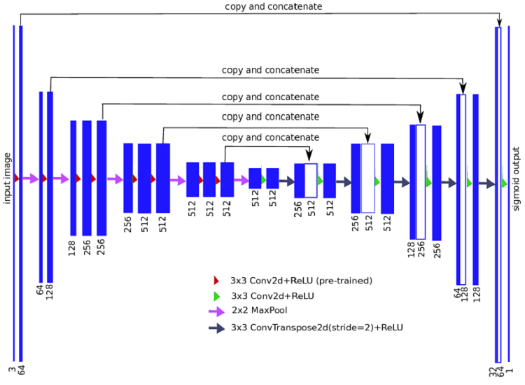

CT Lung Images Segmentation
===
1. CT lung images segmentation implementation using [U-Net : Convolutional Networks for Biomedical Image Segmentation](https://lmb.informatik.uni-freiburg.de/people/ronneber/u-net/). 

 
2. CT lung images segmentation implementation using [TernausNet](https://arxiv.org/pdf/1801.05746.pdf).   

 
Overview
---
### Data
Finding and Measuring Lungs in CT Data
This dataset can be found https://www.kaggle.com/kmader/finding-lungs-in-ct-data.

### Pre-Processing
After importing the image data from the alpha channel, convert unsigned int image to int and resize 64 x 64.

Requirement
---
* Python
* Keras
* Python packages : numpy, matplotlib, opencv, and so on...

Reference Implementations
---
+ https://github.com/zhixuhao/unet
+ https://github.com/ternaus/TernausNet